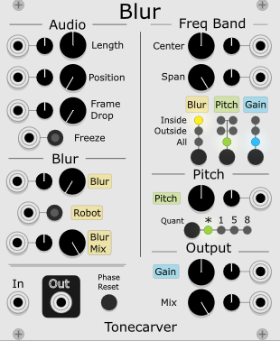
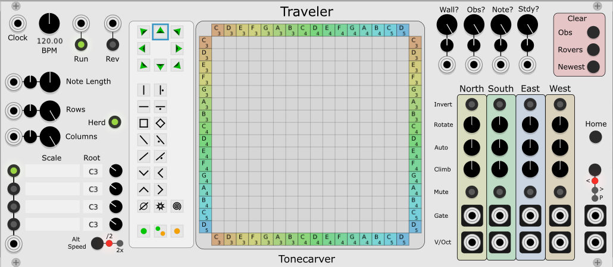

# tcRackModules
## Blur

Blur is a VCV Rack module that does spectral manipulations on incoming audio.

### Usage Hints: 

**Length** - sets the the number of seconds worth of FFT frames to store in a history buffer. The buffer is limited to 10,000 frames or 10 seconds, whichever is reached first, depending on the sample rate, FFT frame size, and oversample settings. 

**Position** - the position in the history buffer where the output is generated from. Think of the history buffer as a kind of delay line and the position being the read head. Output is generated by interpolating the values between frames around the playabck position. Modulation the position plays the frames forward and backward. 
Modulate slower/faster than real time to get slowed down and sped up playback.

**Frame Drop** - sets the probability of discarding new audio input. Smaller values let more frames in, larger values let fewer frames in. At 0, all incoming audio is framed up and passed into the history buffer. At 100%, no new audio is added to the history buffer, effectively freezing the contents of the buffer. NOTE: This caught me a few times where I saved a rack with Frame Dropper set to 100% while manipulating captured audio. On re-opening the rack, Blur made no output. It took me a bit to realize that the Dropper was full on, suppressing incoming audio. Backing off the Dropper opened the pipe for new audio.

**Freeze** - freezes the history buffer contents by disabling all audio input. When freeze is disabled, the Frame Dropper controls the percentage of new audio allowed into the history buffer.

**Blur** - sets the reach of the bin picker. The bin picker selects bin values randomly within a range of frames on either side of the playback position. The Blur control sets the distance away from the position that the picker can pick from. A 0 value means use only local bins. A maximum value means pick from any frame in the history buffer.

**Robot** - simulates classic robot effect by setting all phases to 0. Blur Mix also controls the wet/dry ratio for this effect. Watch your levels with this effect, robotizing seems to increase or decrease the overall level of the output by a few dB depending on the signal being affected.

**Blur Mix** - controls the wet/dry mix of the blurred and non-blurred output. Try high blur with low mix and vice-versa.

**Center** - the center frequency of the Freq Band.

**Span** - the width of the Freq Band. 

**Inside**, **Outside**, **All** - selects how the Freq Band affect the Blur, Pitch and Gain controls.
- Inside: frequencies inside the range are affected by the effect, frequencies outside are suppressed
- Outside: frequencies inside the range are suppressed, frquencies outside the range are affected by the effect
- All: all frequencies are affected by the effect.

The Pitch selector has two additional settings that preserve the non-selected frequencies.

**Pitch** - increase or decrease pitch. With quantization the pitch can swing from +/- 3 octaves in selected semitone/fifth/octave steps. When quantization is not active the pitch shifting is smooth - CCW motion takes the pitch down to very low, barely audible, good for tape-stop type effects. CW motion on the right of the dial raises the pitch up to 2 octaves higher.

**Quant** - pitch quantization
-* no quantization 
-1 semitones
-5 fifths and octaves
-8 octaves 

**Gain** - output gain. CCW drops to -60 dB. CW raises to +12 dB.

**Mix** - wet/dry blend. Fully CCW is 100% dry, fully CW is 100% wet.

**Phase Reset** - zeroes out the phase history buffers to adjust for tiny residuals that can sometimes build up over time.

**Popup Menu** has options to set the FFT size and the Oversample amount. Low FFT sizes are good for distorting the sound. Low oversample amounts also tend to introduce noise and artifacts. Larger FFT sizes with oversamlple of 4 or 8 provide better clarity. FFT Size 2048 with oversample 4 is a good starting point. Experimentation is the key!

## Traveler

The Traveler VCV Rack module is a generative sequencer. A set of rovers move through a matrix until they encounter a wall, another rover, or an obstacle. When a rover encounters a wall, it emits a V/Oct level corresponding to the pitch assigned to the wall at the point of collision, then then reverses direction. When a rover encounters another rover, both rovers are rotated clockwise. When a rover encounters an obstacle, the effects of the obstacle are applied to the rover which could alter its position, its direction, or its speed, depending on the type of obstacle. 
### Usage Hints: 

**Clock** - Input for external clock. An external clock signal overrides the internal BPM setting.

**BPM** - Internal BPM clock controls rate of rover movement when external clock is not connected.

**Run** - Run / Pause control.

**Rev** - Reverse rover directions

**Note Length** - The note/gate length. In the middle the gate length equals 1 beat. At maximum the gate length is 2 beats per note.  

**Rows** - The number of rows in the matrix

**Columns** - The number of columns in the matrix

**Herd** - Controls how rover positions are affected when the number of rows and columns change. When herding is enabled, rovers inside the matrix are swept along with wall movements as the matrix size shrinks so that they always remain inside the matix. When herding is disabled, rovers maintain their position and remain outside the active portion of the matrix if the matrix size shrinks enough to exclude their position. The rovers remain in place and can be brought back to active status by expanding the matrix to its pre-shrunk size.  

**Scale** - Traveler can load up to 4 scales at a time each with independent root note. To load a scale, right-click to show the contenxt menu, select a scale, and browse to the scales folder to select a scale file. A scale may be activated by clicking on the selection button to the left of the scale name or by providing appropriate voltage to the scale selector CV. Scale selector CV is unipolar, 0..10v, divided into 4 equal ranges corresponding to the scale to be selected: [0,2.5), [2.5,5), [5,7.5), [7.5,10)

**Root** - The root note for a scale

**Alt Speed** - Selects the travel rate for a rover moving at the alternate speed. /2 = half-speed, x2 = double speed

**Rover & Obstacle Palette** - Select Rover (triangle) or Obstacle to be inserted into matrix. To insert the selected item, left-click on a cell in the matrix. 

**Wall?** - Probability of a rover reflecting off a wall. Fully CW is 100% probable, awlays reflect. Fully CCW is 0% probable, never reflect. Rovers that do not reflect are 'passed through' and appear on the opposite wall heading in the same direction.

**Obs?** - Probability of an obstacle affecting a rover that encounters it. Fully CW is 100% probable, awlays affect. Fully CCW is 0% probable, never affect.

**Note?** - Probability of a rover striking a wall resulting in V/Oct output. Fully CW is 100% probable, awlays output. Fully CCW is 0% probable, never output.

**Stdy?** - Probability of a rover maintaining a steady path. Fully CW is 100% probable, awlays steady. Fully CCW is 0% probable, never steady.

**Clear** - Controls to clear the occupants in the matrix

**North / South / East / West** - Columns of controls assigned to each of the 4 walls in the matrix.

**Invert** - Order scale ascending or descending.

**Rotate** - Rotate scale not positions.

**Auto** - Automatically rotate the scale by this amount every time a rover strikes the wall.

**Climb** - Slide a rover along a wall by this amount following a wall strike.

**Mute** - Disable output from this wall.

**Home** - Reset position of wall notes to match dials. Essentialy undoes all previous auto-rotations.

**Gate** - Gate output. 1 output for each of the 4 walls and 1 output as a summary output. 

**V/Oct** - V/Oct output.  1 output for each of the 4 walls and 1 output as a summary output. 

**<, >, P** - Output Mode selector. Select '<' to output the minimum pitch, '>' to output the maximum pitch, and 'P' to emit polyphonic output. Set the maximum number of polyphony voices via the right-click menu.

**Right-Click Menu** - Right click outside of the matrix and palette areas to bring up the context menu. The content menu allows you to set the maximum polyphony and load scale files. 

**USAGE TIPS** - A small matrix of a few rows and columns can produce great results. A very busy matrix of any size can be tamed by reducing the Note and Wall probabilities, muting walls, etc. 

